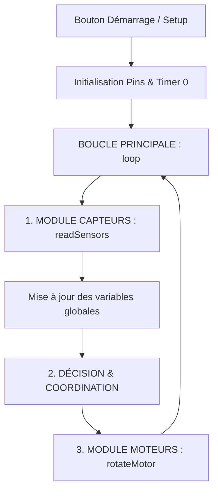

# 🚗 Robot Suiveur de Ligne à 4 Moteurs

Ce dépôt contient le code de commande propre et optimisé pour le robot suiveur de ligne inspiré de la vidéo de **'Hash Include Electronics'**. 

Le code a été conçu avec une architecture modulaire en C++ procédural (sans classes) pour simplifier la compréhension et assurer une excellente coordination temporelle. Il résout les problèmes de blocage à basse vitesse des moteurs grâce à une optimisation matérielle du registre des timers.

---

## 🛠️ Spécifications & Câblage Matériel

### 1. Capteurs Infrarouges (IR)
* **Capteur Droit :** Connecté à la broche numérique **D11**
* **Capteur Gauche :** Connecté à la broche numérique **D12**
* **Comportement logique :** 
  * `HIGH` lorsqu'il se trouve sur la **ligne noire**
  * `LOW` lorsqu'il est sur la **surface blanche**

### 2. Contrôleur Moteurs L298N & Châssis 4 Moteurs
Bien que votre châssis possède **4 moteurs CC (4 roues motrices)**, le driver L298N ne possède que **2 canaux de commande physiques** (A et B). Les moteurs doivent donc être branchés en parallèle sur les bornes du driver :

* **Groupe Moteurs Droit (Avant + Arrière) :** Branchés ensemble en parallèle sur les sorties `OUT1` & `OUT2` du L298N.
  * **Vitesse (PWM) :** Connecté à la broche **D5** (ENA)
  * **Direction :** Broches **D7** (IN1) et **D8** (IN2)
* **Groupe Moteurs Gauche (Avant + Arrière) :** Branchés ensemble en parallèle sur les sorties `OUT3` & `OUT4` du L298N.
  * **Vitesse (PWM) :** Connecté à la broche **D6** (ENB)
  * **Direction :** Broches **D9** (IN3) et **D10** (IN4)

* **Vitesse Cible :** Vitesse fixée à **180** (valeur PWM de 0 à 255).

---

## 📐 Architecture Logicielle

Le code applique une séparation stricte des tâches :



1. **Module de Lecture (`readSensors`) :** Interroge l'état des deux capteurs numériques et enregistre les résultats dans des variables globales. Il ne prend aucune décision.
2. **Module d'Action (`rotateMotor`) :** Reçoit des commandes de vitesses positives uniquement (la voiture ne recule pas) et pilote directement les broches du L298N.
3. **Logique de Guidage (dans le `loop`) :** Analyse les données de détection et appelle le module moteur de manière coordonnée.

---

## ⚡ Optimisation Matérielle : Fréquence PWM à 7812.5 Hz

Par défaut, l'Arduino Uno génère une fréquence PWM de **976.56 Hz** sur les broches D5 et D6 (gérées par le **Timer 0**). Cette fréquence trop basse engendre un sifflement aigu désagréable et provoque des blocages moteurs à bas régime (les moteurs TT gear ne parviennent pas à vaincre les frottements internes).

Dans la fonction `setup()`, nous modifions directement le registre `TCCR0B` du microcontrôleur ATmega328P pour changer le diviseur de fréquence (prescaler) de 64 à **8** :
```cpp
TCCR0B = (TCCR0B & 0b11111000) | 0b00000010;
```
Cela permet d'élever la fréquence PWM à exactement **7812.5 Hz** ($16\text{ MHz} / (8 \times 256)$). Les moteurs fonctionnent ainsi de façon fluide, sans à-coups ni sifflements.

> [!WARNING]  
> **Note d'expert :** Le Timer 0 régit également les fonctions de temps internes d'Arduino (`delay()`, `millis()`, `micros()`). En divisant le prescaler par 8, le temps s'écoule **8 fois plus vite** pour le système.
> * Si vous avez besoin de faire un temps d'attente réel d'une seconde ($1000\text{ ms}$), vous devez appeler :
>   ```cpp
>   delay(8000); // 8000 millisecondes internes = 1 seconde réelle
>   ```

---

## 🔄 Logique de Pilotage (Sans Recul)

Le robot évite activement le blanc et se recentre sur la ligne noire sans jamais enclencher de marche arrière. Les virages sont fluides et s'effectuent en arrêtant le train de roues intérieur au virage.

| État Capteur Gauche | État Capteur Droit | Action | Vitesse Gauche | Vitesse Droite | Rationale |
| :---: | :---: | :---: | :---: | :---: | :--- |
| `LOW` (Blanc) | `LOW` (Blanc) | **Avancer** | `180` | `180` | Recherche active de la ligne droite |
| `LOW` (Blanc) | `HIGH` (Noir) | **Pivoter à Droite** | `180` | `0` | Arrêt de la roue droite pour se réaligner |
| `HIGH` (Noir) | `LOW` (Blanc) | **Pivoter à Gauche** | `0` | `180` | Arrêt de la roue gauche pour se réaligner |
| `HIGH` (Noir) | `HIGH` (Noir) | **Arrêt Complet** | `0` | `0` | Fin de parcours ou détection d'intersection |

---

## 🚀 Comment Téléverser le Code

1. Assurez-vous d'avoir installé l'**IDE Arduino**.
2. Récupérez le fichier `voiture-suiveur-de-ligne.ino` présent dans la branche `capteurbranch`.
3. Connectez votre Arduino Uno en USB.
4. Sélectionnez la carte **Arduino Uno** et le port COM approprié dans l'IDE.
5. Cliquez sur **Téléverser**.