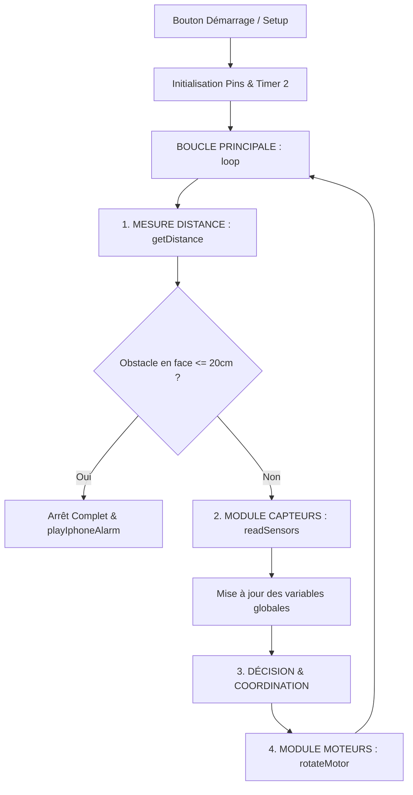

# 🚗 Robot Suiveur de Ligne à 4 Moteurs, Détecteur d'Obstacles & Alarme iPhone

Ce dépôt contient le code de commande propre et optimisé pour le robot suiveur de ligne inspiré de la vidéo de **'Hash Include Electronics'**. 

Le code a été conçu avec une architecture modulaire en C++ procédural (sans classes) pour simplifier la compréhension et assurer une excellente coordination temporelle. Il résout les problèmes de sifflement et de blocage à basse vitesse des moteurs grâce à une configuration matérielle fine des timers.

---

## 🛠️ Spécifications & Câblage Matériel (Pinout Mis à Jour)

### 1. Capteurs Infrarouges (IR)
* **Capteur Droit (Capteur 1) :** Connecté à la broche numérique **D13**
* **Capteur Gauche (Capteur 2) :** Connecté à la broche numérique **D4**
* **Comportement logique :** 
  * `HIGH` lorsqu'il se trouve sur la **ligne noire**
  * `LOW` lorsqu'il est sur la **surface blanche**

### 2. Contrôleur Moteurs L298N & Châssis 4 Moteurs
Les 4 moteurs du châssis (4 roues motrices) sont branchés en parallèle de chaque côté sur le L298N :
* **Groupe Moteurs Droit (Avant + Arrière) :** Branchés ensemble en parallèle sur les sorties `OUT1` & `OUT2` du L298N.
  * **Vitesse (PWM) :** Connecté à la broche **D11** (ENA)
  * **Direction :** Broches **D10** (IN1) et **D9** (IN2)
* **Groupe Moteurs Gauche (Avant + Arrière) :** Branchés ensemble en parallèle sur les sorties `OUT3` & `OUT4` du L298N.
  * **Vitesse (PWM) :** Connecté à la broche **D3** (ENB)
  * **Direction :** Broches **D6** (IN3) et **D5** (IN4)

* **Vitesse Cible :** Vitesse fixée à **180** (valeur PWM de 0 à 255).

### 3. Capteur Ultrason HC-SR04 & Avertisseur (Buzzer)
Pour assurer la détection et la sécurité du robot face à un obstacle :
* **Trigger (Trig) :** Connecté à la broche **D7** (Émission du signal)
* **Echo :** Connecté à la broche **D8** (Réception du signal de retour)
* **Buzzer Passif :** Connecté à la broche **D2** (Émission de la sirène)
* **Distance critique :** **20 cm** (en dessous de ce seuil, le robot réalise un arrêt d'urgence).

---

## 📐 Architecture Logicielle

Le code applique une séparation stricte des tâches :



1. **Module de Distance (`getDistance`) :** Gère les microsecondes d'émissions/réceptions du capteur HC-SR04 pour retourner une distance propre en centimètres.
2. **Module de Lecture IR (`readSensors`) :** Interroge l'état des deux capteurs numériques et enregistre les résultats dans des variables globales.
3. **Module Avertisseur (`playIphoneAlarm`) :** Joue la mélodie caractéristique "Radar / Classic Alarm" des téléphones iPhone grâce à une génération logicielle bare-metal indépendante des timers.
4. **Module d'Action (`rotateMotor`) :** Reçoit des commandes de vitesses positives uniquement (la voiture ne recule pas) et pilote directement les broches du L298N.
5. **Logique de Guidage (dans le `loop`) :** Analyse les données de détection et appelle le module moteur de manière coordonnée.

---

## ⚡ Fréquence PWM à 7812.5 Hz sur le Timer 2

ENA et ENB étant désormais connectés aux broches **D11** et **D3**, le signal PWM est piloté par le **Timer 2** (et non plus par le Timer 0).

Pour élever la fréquence à exactement **7812.5 Hz** afin de fluidifier les moteurs TT gear et éliminer le sifflement, nous configurons directement le registre du Timer 2 (`TCCR2A` et `TCCR2B`) en mode Fast PWM avec un prescaler de **8** :
```cpp
// 1. Configurer le Timer 2 en mode Fast PWM 8-bit
TCCR2A = (TCCR2A & 0b11111000) | 0b00000011;

// 2. Configurer le diviseur de fréquence (prescaler) à 8
TCCR2B = (TCCR2B & 0b11111000) | 0b00000010;
```

> [!TIP]  
> **Note d'expert :** Contrairement au Timer 0, le **Timer 2 n'interfère pas** avec le temps interne de l'Arduino Uno.
> * Les fonctions `delay()` et `millis()` fonctionnent de manière **parfaitement exacte** à vitesse normale !
> * Aucune correction ou multiplication par 8 sur vos délais n'est nécessaire.
> * Pour éviter que la fonction standard `tone()` ne perturbe le Timer 2 configuré manuellement, le buzzer est piloté par une fonction logicielle bare-metal `buzzerTone()`, garantissant une robustesse absolue et sans conflit.

---

## 🔄 Logique de Pilotage (Sans Recul)

Le robot évite activement le blanc et se recentre sur la ligne noire sans jamais enclencher de marche arrière. Les virages sont fluides et s'effectuent en arrêtant le train de roues intérieur au virage.

| État Capteur Gauche (D4) | État Capteur Droit (D13) | Action | Vitesse Gauche | Vitesse Droite | Rationale |
| :---: | :---: | :---: | :---: | :---: | :--- |
| `LOW` (Blanc) | `LOW` (Blanc) | **Avancer** | `180` | `180` | Recherche active de la ligne droite |
| `LOW` (Blanc) | `HIGH` (Noir) | **Pivoter à Droite** | `180` | `0` | Arrêt des roues droites pour se réaligner |
| `HIGH` (Noir) | `LOW` (Blanc) | **Pivoter à Gauche** | `0` | `180` | Arrêt des roues gauches pour se réaligner |
| `HIGH` (Noir) | `HIGH` (Noir) | **Arrêt Complet** | `0` | `0` | Fin de parcours ou détection d'intersection |

---

## 🚀 Comment Téléverser le Code

1. Assurez-vous d'avoir installé l'**IDE Arduino**.
2. Récupérez le fichier `voiture-suiveur-de-ligne.ino` présent dans la branche `capteurbranch`.
3. Connectez votre Arduino Uno en USB.
4. Sélectionnez la carte **Arduino Uno** et le port COM approprié dans l'IDE.
5. Cliquez sur **Téléverser**.